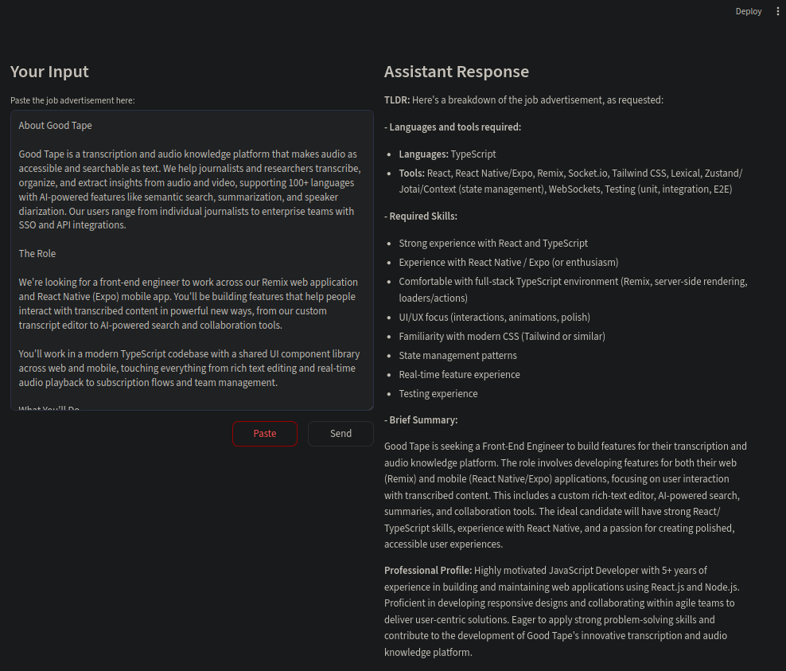

# Job Advertisement Processing Tool

This is a Python script that utilizes `langchain_core` and `streamlit` libraries to process job advertisements using Ollama. The tool allows users to paste job advertisement text or import it from a clipboard and generates a TLDR summary of the job ad and a professional profile paragraph for their CV using the input from INPUT.txt.

## Features

- **TLDR Summary**: Summarizes lengthy job ads.
- **Professional Profile Paragraph**: Attempts to generate a professional profile paragraph using the information inserted into INPUT.txt
- **User Interface**: Built with Streamlit for an intuitive and user-friendly interface.

## Requirements

- Ollama running locally
- gemma3n:e4b model downloaded

## Usage

1. Modify the src/INPUT.txt by adding your CV to make the LLM attempt to write a professional profile.

2. Start `ollama serve`

3. Run the script using UV, to start the graphical user interface:

   ```bash
   uv run streamlit run src/main.py
   ```
   
To make streamlit not share statistics:

   ```bash
   STREAMLIT_BROWSER_GATHER_USAGE_STATS=false uv run streamlit run src/main.py
   ```

4. The Streamlit app will open in your web browser.

5. Input job ad and click "Send" or click "Paste".

 

